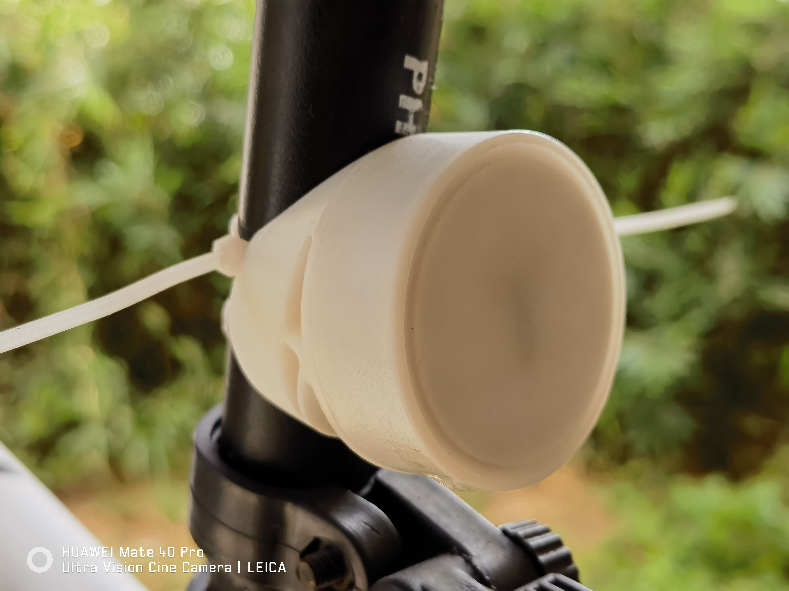
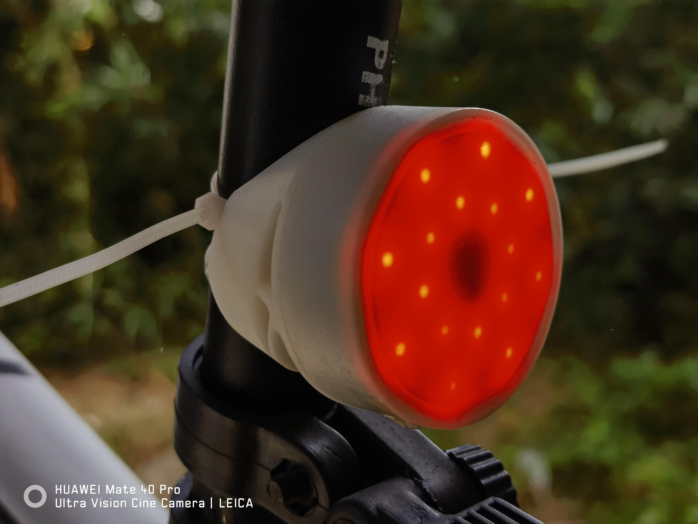

# Bicycle_Light
自行车灯系列

**开源协议：CC-BY-NC-SA 3.0，知识共享许可协议-署名-非商业使用-相同方式共享。**

---

> 目前仅有尾灯

# 尾灯

> 已知问题： (寒假改)
> 
>   1. 待机电流大，800mAh电池也就待机三天左右。下一版将会给非mcu器件加电子开关，待机时断开电源；
> 
>   2. 环境光API写了，逻辑部分没写；
> 
>   3. STC是QFN封装，对烙铁用户不友好；
>
>   4. 霍尔传感器“防盗”没测试；
> 
>   5. 刹车功能较难触发（急刹和撞墙才能识别到），且过沟沟坎坎会误触发。下一版取消（或更换传感器）。
> 
>   6. STC手册说是可以使用模拟USB下载程序，但是我电脑无法枚举设备，被迫转了串口下载。现支持不断电下载。 ：(

## 硬件
https://oshwhub.com/opticalmoe/bicycle_light

1. STC8G1K08-QFN20；

2. 16通道LED恒流驱动 TM5020A；

3. TC4056A 设定400mA充电电流；

4. 800mAh聚合物电池，30*34mm；

## 固件
1. 晃动/按键开机，无动作20s/按键关机；

2. 正面左按键开关机，右按键显示电量。一颗灯代表10%。

## 结构
Fusion360

---

